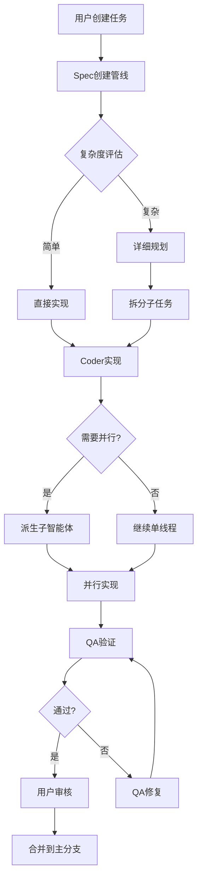

# Aperant (Auto Claude) 深度分析报告

> 分析时间: 2026-04-13  
> 仓库: https://github.com/AndyMik90/Aperant  
> Stars: 13,938 ⭐ (增长极快)

---

## 一、项目概述

### 1.1 核心定位

**Aperant (Auto Claude)** = **自主多智能体编程框架**

```
用户描述目标 → AI智能体自主规划、实现、验证 → 用户审核合并
```

**愿景**：让AI真正理解你的需求，自主完成软件开发全流程。

### 1.2 关键数据

| 指标 | 数值 |
|-----|------|
| Stars | 13,938 ⭐ |
| 创建时间 | 2025-12-04 |
| 最后更新 | 2026-04-13 |
| 开发语言 | TypeScript (前端) + Python (后端) |
| 许可证 | AGPL-3.0 |
| 活跃度 | 🔥 极高 (每2-3天一个版本) |

---

## 二、核心特性

### 2.1 多智能体协作系统

```
┌─────────────────────────────────────────────────────┐
│                 用户任务请求                        │
└─────────────────────────────────────────────────────┘
                        ↓
┌─────────────────────────────────────────────────────┐
│          Spec创建管线 (复杂度评估+规格编写)         │
└─────────────────────────────────────────────────────┘
                        ↓
┌─────────────────────────────────────────────────────┐
│     Planner Agent (规划师)                         │
│     - 分析需求，拆分子任务                          │
│     - 生成实现计划                                  │
└─────────────────────────────────────────────────────┘
                        ↓
┌─────────────────────────────────────────────────────┐
│     Coder Agent (程序员)                           │
│     - 实现具体功能                                  │
│     - 可派生并行子智能体 (最多12个)                │
└─────────────────────────────────────────────────────┘
                        ↓
┌─────────────────────────────────────────────────────┐
│     QA Reviewer (质量检查)                         │
│     - 自动验证实现质量                              │
│     - 发现潜在问题                                  │
└─────────────────────────────────────────────────────┘
                        ↓
┌─────────────────────────────────────────────────────┐
│     QA Fixer (问题修复)                            │
│     - 自动修复发现的问题                            │
└─────────────────────────────────────────────────────┘
                        ↓
┌─────────────────────────────────────────────────────┐
│          用户审核 + 合并                           │
└─────────────────────────────────────────────────────┘
```

### 2.2 技术亮点

| 特性 | 描述 |
|-----|------|
| **并行执行** | 最多12个智能体终端并行工作 |
| **隔离工作区** | 所有改动在git worktree，主分支安全 |
| **自验证QA** | 内置质量保障循环，自动发现问题 |
| **智能合并** | AI驱动的语义合并，自动解决冲突 |
| **记忆系统** | Graphiti知识图谱，跨会话保持洞察 |
| **多账号切换** | 当一个账号达到限制，自动切换到可用账号 |
| **跨平台** | Windows、macOS、Linux原生桌面应用 |

### 2.3 集成生态

| 集成 | 功能 |
|-----|------|
| **GitHub** | 导入Issues、AI调查、PR创建和审核 |
| **GitLab** | MR创建和审核 |
| **Linear** | 任务同步、进度跟踪 |
| **Claude Code** | OAuth订阅或API profile |

---

## 三、架构设计

### 3.1 Monorepo结构

```
Aperant/
├── apps/
│   ├── backend/          # Python后端 - 所有智能体逻辑
│   │   ├── core/         # 客户端、认证、工作树、平台抽象
│   │   ├── security/     # 命令白名单、验证器、钩子
│   │   ├── agents/       # 规划器、编码器、会话管理
│   │   ├── qa/           # 审核器、修复器、循环、标准
│   │   ├── spec/         # Spec创建管线
│   │   ├── cli/          # CLI命令
│   │   ├── context/      # 任务上下文构建、语义搜索
│   │   ├── runners/      # 独立运行器
│   │   ├── services/     # 后台服务、恢复编排
│   │   ├── integrations/ # Graphiti、Linear、GitHub
│   │   ├── project/      # 项目分析、安全profile
│   │   ├── merge/        # 智能体并行意图感知语义合并
│   │   └── prompts/      # 智能体系统提示词(.md)
│   │
│   └── frontend/         # Electron桌面UI
│       └── src/
│           ├── main/     # Electron主进程
│           ├── preload/  # 预加载脚本
│           ├── renderer/ # React UI
│           │   ├── components/  # UI组件
│           │   ├── stores/      # Zustand状态管理(24+ store)
│           │   └── features/     # 功能模块
│           └── shared/   # 共享类型、i18n、常量、工具
│
├── guides/               # 文档
├── tests/                # 测试套件
└── scripts/              # 构建和工具脚本
```

### 3.2 技术栈详解

#### 前端 (Electron应用)

| 技术 | 版本 | 用途 |
|-----|------|------|
| React | 19 | UI框架 |
| TypeScript | strict | 类型安全 |
| Electron | 39 | 桌面应用 |
| Zustand | 5 | 状态管理 |
| Tailwind CSS | v4 | 样式 |
| Radix UI | - | 可访问组件 |
| xterm.js | 6 | 终端仿真 |
| Vite | 7 | 构建工具 |
| Vitest | 4 | 测试框架 |
| Biome | 2 | Linting |

#### 后端 (Python智能体)

| 模块 | 用途 |
|-----|------|
| Claude Agent SDK | 所有AI交互 |
| Graphiti | 知识图谱记忆 |
| Git Worktree | 隔离工作区 |
| pytest | 测试 |

### 3.3 关键设计模式

#### 1. 智能体提示词系统 (`apps/backend/prompts/`)

| 提示词 | 目的 |
|--------|------|
| planner.md | 实现计划+子任务拆分 |
| coder.md / coder_recovery.md | 子任务实现 / 恢复 |
| qa_reviewer.md / qa_fixer.md | 验收验证 / 问题修复 |
| spec_gatherer.md | 需求收集 |
| spec_researcher.md | 技术调研 |
| spec_writer.md | 规格编写 |
| spec_critic.md | 规格批评 |
| complexity_assessor.md | 复杂度评估 |

#### 2. Spec目录结构 (`.auto-claude/specs/XXX-name/`)

```
spec_name/
├── spec.md                  # 详细规格
├── requirements.json        # 需求数据
├── context.json            # 上下文数据
├── implementation_plan.json # 实现计划
├── qa_report.md            # QA报告
└── QA_FIX_REQUEST.md       # QA修复请求
```

#### 3. 跨平台抽象

```typescript
// ❌ 错误做法
if (process.platform === 'win32') { ... }

// ✅ 正确做法
import { isWindows, findExecutable } from '@main/platform';
if (isWindows()) { ... }
const cmd = await findExecutable('node');
```

---

## 四、工作流程详解

### 4.1 完整生命周期



### 4.2 Git Worktree隔离

```
project/
├── .git/
├── .auto-claude/
│   ├── specs/
│   │   ├── 001-feature-a/  # Spec 001的worktree
│   │   └── 002-feature-b/  # Spec 002的worktree
│   └── worktrees/
│       ├── 001/            # 独立Git工作区
│       └── 002/            # 不会污染主分支
└── (主分支保持干净)
```

**优势**：
- ✅ 多个任务并行开发
- ✅ 主分支始终可部署
- ✅ 失败不影响主代码
- ✅ 智能语义合并

### 4.3 记忆系统 (Graphiti)

```python
# 存储洞察
graphiti.add_episode(
    name="database-optimization",
    content="PostgreSQL CONNECTION_POOL=100会导致超时",
    source_description="QA验证过程"
)

# 后续会话检索
insights = graphiti.search("database timeout")
# → 找到之前的优化经验
```

---

## 五、核心创新点

### 5.1 多账号自动切换

```typescript
// src/main/claude-profile/
├── credential-utils.ts    # OS凭证存储
├── token-refresh.ts       # OAuth自动刷新
├── usage-monitor.ts       # 使用量跟踪
└── profile-scorer.ts      # Profile评分
```

**工作流程**：
1. 监控当前账号使用量
2. 检测到限制时自动切换
3. 选择可用性最高的账号
4. 无缝继续任务

### 5.2 智能体终端管理

```typescript
// src/main/terminal/
├── pty-daemon.ts         # 后台PTY进程管理
├── pty-manager.ts       # PTY生命周期
├── terminal-lifecycle.ts # 会话创建/清理
└── claude-integration.ts # Claude SDK集成
```

**能力**：
- 最多12个并行终端
- 每个终端独立的Claude上下文
- 任务上下文一键注入
- 实时状态跟踪

### 5.3 QA循环系统

```python
# qa/ 目录
├── reviewer.py    # 验证实现
├── fixer.py       # 修复问题
├── loop.py        # QA循环控制
└── criteria.py    # 验收标准
```

**流程**：
```
实现 → Review → 发现问题 → Fix → Review → 通过
(最多N轮，避免死循环)
```

---

## 六、与GDC数据提取的关联

### 6.1 为什么这个项目有趣？

**Aperant解决的问题**：
- ✅ 多智能体协作
- ✅ 动态页面内容处理
- ✅ 并行任务执行
- ✅ 自动验证和修复

**与GDC Vault问题对比**：

| 问题 | Aperant的解决方案 |
|-----|------------------|
| JavaScript动态加载 | 智能体可等待加载完成 |
| 分页内容不刷新 | 可注入脚本、操作DOM |
| 大量页面需要处理 | 12个智能体并行提取 |
| 数据质量验证 | QA系统自动检查 |

### 6.2 使用Aperant的思路

如果用Aperant来提取GDC数据：

```python
# Spec: 提取GDC 2021-2025所有演讲数据

# Planner生成的子任务：
# 1. 分析GDC Vault页面结构
# 2. 实现分页处理逻辑
# 3. 提取演讲元数据
# 4. 验证数据完整性
# 5. 生成统计报告

# 4个并行Coder智能体：
# - Agent A: GDC 2025 + 2024
# - Agent B: GDC 2023 + 2022
# - Agent C: GDC 2021
# - Agent D: 数据合并和去重

# QA验证：
# - 检查是否有遗漏
# - 验证数据格式
# - 自动修复问题
```

---

## 七、关键代码片段分析

### 7.1 Claude SDK客户端创建

```python
# apps/backend/core/client.py

def create_client():
    """创建配置好的ClaudeSDKClient"""
    return ClaudeSDKClient(
        security_hooks=...,
        tool_permissions=...,
        mcp_servers=...,
    )
```

### 7.2 智能体提示词示例

```markdown
# apps/backend/prompts/planner.md

你是Planner智能体。你的任务是：
1. 理解用户的需求
2. 分析技术可行性
3. 拆分为可执行的子任务
4. 生成详细的实现计划

输出格式：
- 总体架构设计
- 子任务列表（优先级排序）
- 每个子任务的验收标准
- 依赖关系图
```

### 7.3 终端智能体管理

```typescript
// src/main/agent/agent-process.ts

export class AgentProcess {
  async spawn(specNumber: string) {
    const process = spawn('python', ['run.py', '--spec', specNumber]);
    
    process.stdout.on('data', (data) => {
      this.handleOutput(data);
    });
    
    process.stderr.on('data', (data) => {
      this.handleError(data);
    });
  }
}
```

---

## 八、技术决策亮点

### 8.1 为什么用两种语言？

| 角色 | 语言 | 理由 |
|-----|------|------|
| 智能体逻辑 | Python | AI生态、数据处理、脚本编写 |
| 桌面应用 | TypeScript | Electron生态、类型安全、UI开发 |

**桥接方式**：
- Electron主进程调用Python子进程
- 通过JSON/文本流通信

### 8.2 为什么用Graphiti做记忆？

| 特性 | 传统数据库 | Graphiti |
|-----|-----------|----------|
| 数据结构 | 表格 | 知识图谱 |
| 关系表达 | 外键 | 图边 |
| 语义查询 | SQL | 图遍历 |
| 洞察保留 | 手动 | 自动 |

### 8.3 为什么用Git Worktree？

| 方案 | 优点 | 缺点 |
|-----|------|------|
| 分支切换 | 简单 | 频繁切换慢 |
| Clone多个仓库 | 隔离好 | 占空间 |
| Git Worktree | 隔离+共享.git | 学习曲线 |

---

## 九、与OpenClaw的对比

| 维度 | Aperant | OpenClaw |
|-----|---------|----------|
| 定位 | AI编程框架 | AI Agent运行时 |
| 智能体数量 | 多智能体协作 | 单智能体+子智能体 |
| 记忆系统 | Graphiti知识图谱 | MEMORY.md文件 |
| 工作隔离 | Git Worktree | Workspace目录 |
| 任务管理 | Kanban + Specs | SESSION + spawn |
| 认证管理 | 多账号切换 | 单账号 |
| 终端集成 | PTY Daemon | exec工具 |
| MCP支持 | 有 | 有 |

**互补性**：
- Aperant可以借鉴OpenClaw的channel集成（Feishu、企业微信等）
- OpenClaw可以借鉴Aperant的多智能体协作和QA循环

---

## 十、学习价值

### 10.1 架构设计

- ✅ 完整的多智能体协作系统
- ✅ 规格驱动的开发流程
- ✅ 自动化QA验证循环
- ✅ 智能记忆系统

### 10.2 技术实现

- ✅ Electron + React桌面应用最佳实践
- ✅ Python后端架构
- ✅ 跨平台抽象
- ✅ 安全沙箱设计
- ✅ 并发智能体管理

### 10.3 产品设计

- ✅ Kanban可视化
- ✅ 终端集成UI
- ✅ 多账号无缝切换
- ✅ 错误恢复机制

---

## 十一、安装和使用

### 11.1 安装

```bash
# Linux
wget https://github.com/AndyMik90/Auto-Claude/releases/download/v2.7.6/Auto-Claude-2.7.6-linux-x86_64.AppImage
chmod +x Auto-Claude-2.7.6-linux-x86_64.AppImage
./Auto-Claude-2.7.6-linux-x86_64.AppImage
```

### 11.2 前置要求

- Claude Pro/Max订阅
- Claude Code CLI: `npm install -g @anthropic-ai/claude-code`
- Git仓库

### 11.3 CLI使用

```bash
# 创建Spec
python spec_runner.py --interactive

#运行构建
python run.py --spec 001

# 审核
python run.py --spec 001 --review

# 合并
python run.py --spec 001 --merge
```

---

## 十二、总结

### 核心价值

**Aperant = AI时代的软件开发流程革命**

它不仅仅是工具，而是：
- 📋 任务规划系统
- 👥 多智能体协作平台
- 🧪 自动化QA系统
- 🧠 知识记忆系统
- 🔗 开发工具链集成

### 适用场景

- ✅ 复杂功能开发（多模块）
- ✅ 重构大型代码库
- ✅ 特性实现+验证
- ✅ 探索性编程
- ❌ 简单脚本（杀鸡用牛刀）

### 学习建议

**初学者**：
1. 从CLI开始，理解核心流程
2. 尝试小任务，观察智能体协作
3. 学习提示词工程

**进阶者**：
1. 研究智能体提示词设计
2. 理解QA循环机制
3. 定制自己的工作流

**专家**：
1. 扩展智能体类型
2. 集成新的开发工具
3. 优化并行策略

---

## 附录：资源链接

- 仓库: https://github.com/AndyMik90/Aperant
- Discord: https://discord.gg/KCXaPBr4Dj
- YouTube: https://www.youtube.com/@AndreMikalsen
- 文档: guides/目录
- 架构: shared_docs/ARCHITECTURE.md

---

*本报告基于2026-04-13公开信息整理*