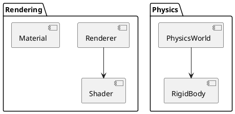

# 游戏引擎源码分析与架构理解方法论

## 概述

游戏引擎是复杂的软件系统,通常包含渲染、物理、音频、脚本、资源管理等众多子系统。本文档提供一套系统化的分析方法论,帮助开发者快速理解大型游戏引擎的架构设计。

---

## 一、主流引擎的文档组织方式

### 1.1 Unreal Engine 文档结构

**分层文档体系:**

1. **官方在线文档** (docs.unrealengine.com)
   - Getting Started: 快速入门指南
   - Programming Guide: 编程指南
   - API Reference: 自动生成的 API 文档
   - Tutorials: 实践教程

2. **源码内文档:**
   ```
   Engine/
   ├── Source/           # 源代码
   │   ├── Runtime/      # 运行时模块
   │   ├── Developer/    # 开发工具
   │   └── Editor/       # 编辑器模块
   ├── Documentation/    # Markdown 文档
   └── Build/           # 构建脚本和文档
   ```

3. **代码注释规范:**
   - 使用 Doxygen 风格注释
   - 类级别注释说明职责和使用场景
   - 函数注释包含参数、返回值、示例代码
   - 使用 `UCLASS()`, `UFUNCTION()` 等宏标记反射元数据

**最佳实践:**
- 从 `Engine/Source/Runtime/Core` 开始阅读,这是基础模块
- 使用 UE 源码中的 `Documentation/` 目录下的 Markdown 文件
- 关注 `*.generated.h` 文件理解反射系统

### 1.2 Unity 源码注释和文档

**文档策略:**

1. **官方文档中心:**
   - Unity Manual: 用户手册
   - Scripting API: 脚本 API 参考
   - Unity Learn: 学习资源
   - GitHub 社区文档

2. **源码组织 (C# 托管代码):**
   ```
   Packages/
   ├── com.unity.render-pipelines.core/  # 核心渲染管线
   │   ├── Documentation~/               # 包内文档
   │   ├── Runtime/                      # 运行时代码
   │   └── Tests/                        # 测试代码
   └── ...
   ```

3. **注释风格:**
   - XML 文档注释 (C# 标准)
   - 使用 `<summary>`, `<param>`, `<returns>` 标签
   - 内联注释解释复杂算法
   - `TODO`, `FIXME`, `HACK` 标记待改进点

**分析方法:**
- Unity 是部分开源的 (C# 部分),从 `Packages/` 目录入手
- 使用 ILSpy 或 dnSpy 查看编译后的 DLL
- 关注 `UnityEngine` 和 `UnityEditor` 命名空间
- Package Manager 中的包包含源码和文档

### 1.3 开源引擎文档策略

#### Godot Engine

**文档体系:**

1. **在线文档:**
   - docs.godotengine.org: 官方文档
   - GitHub Wiki: 社区维护
   - Q&A 论坛: 问答平台

2. **源码结构:**
   ```
   godot/
   ├── core/              # 核心系统
   ├── scene/             # 场景系统
   ├── servers/           # 底层服务器(渲染、物理等)
   ├── modules/           # 可选模块
   └── doc/               # 文档源文件
       ├── classes/       # 类文档 (XML)
       └── tutorials/     # 教程 (Markdown)
   ```

3. **文档生成流程:**
   - 源码中的 XML 注释自动生成 API 文档
   - `doc/classes/*.xml` 记录类和方法文档
   - Sphinx 构建在线文档

**特色:**
- 模块化设计,每个模块独立文档
- 使用 XML 定义类接口契约
- 构建时自动生成绑定代码

#### O3DE (Open 3D Engine)

**文档策略:**

1. **Gems 模块化架构:**
   - 每个功能模块是一个 Gem
   - Gem 包含代码、资产、文档
   - 文档随 Gem 分发

2. **文档结构:**
   ```
   o3de/
   ├── Gems/              # 功能模块
   │   ├── Atom/          # 渲染 Gem
   │   │   ├── Documentation/
   │   │   └── Code/
   │   └── ...
   ├── Code/              # 核心引擎代码
   └── Documentation/     # 全局文档
   ```

3. **Doxygen + Sphinx 组合:**
   - Doxygen 生成 API 参考
   - Sphinx 组织教程和指南
   - Breathe 连接两者

---

## 二、代码分析工具

### 2.1 文档生成工具

#### Doxygen (C/C++ 标准)

**优势:**
- 成熟稳定,支持多种语言
- 自动生成类图和协作图
- 输出 HTML、PDF、CHM 等格式

**配置最佳实践:**

```bash
# 生成配置文件
doxygen -g Doxyfile

# 关键配置项
PROJECT_NAME = "GameEngine"
EXTRACT_ALL = YES
EXTRACT_PRIVATE = YES
HAVE_DOT = YES
UML_LOOK = YES
CALL_GRAPH = YES
CALLER_GRAPH = YES
RECURSIVE = YES
INPUT = src/
```

**输出内容:**
- 类层次结构
- 命名空间组织
- 函数调用图
- 文件依赖关系

#### Sphinx (Python + 多语言)

**优势:**
- 优秀的文档组织能力
- 支持扩展和主题
- 适合编写教程和指南

**集成方案:**
```
Breathe (连接 Doxygen) → Sphinx → HTML/PDF
```

**配置示例:**

```python
# conf.py
extensions = ['breathe', 'sphinx.ext.graphviz']

breathe_projects = {
    'myengine': './doxyxml/'
}
breathe_default_project = 'myengine'
```

### 2.2 代码可视化工具

#### 商业工具

**Structure101:**
- 分析代码结构和复杂度
- 识别架构违规
- 支持多种语言 (Java, C++, C#)
- 可视化依赖关系

**Understand (SciTools):**
- 静态代码分析
- 生成依赖图和调用图
- 度量代码复杂度
- 支持大型代码库

** strengths:**
- 快速分析大型项目
- 可视化质量高
- 提供架构规则检查

#### 开源工具

**Graphviz + Doxygen:**
```bash
# 自动生成调用图
doxygen Doxyfile
# 生成 dot 文件可自定义
dot -Tpng callgraph.dot -o callgraph.png
```

**CMake Graphviz 输出:**
```bash
# 生成目标依赖图
cmake --graphviz=deps.dot ..
dot -Tpng deps.dot -o deps.png
```

**PlantUML:**


### 2.3 架构图自动生成

**工具链组合:**

1. **源码 → Doxygen → XML**
   ```bash
   doxygen Doxyfile
   ```

2. **XML → Graphviz/D3.js → 可视化**
   - 使用 `xsltproc` 转换 XML
   - 或使用工具如 CodeMap、Gource

3. **实时分析工具:**
   - **Sourcetrail:** 交互式代码探索
   - **Codecity:** 3D 可视化代码结构
   - **Gource:** 版本控制历史动画

**推荐工具栈:**
```
源码分析: Doxygen + Clang Tools
依赖可视化: Graphviz + CMake
交互探索: Sourcetrail (开源版)
文档生成: Sphinx + Breathe
```

---

## 三、模块化分析方法

### 3.1 划分引擎模块边界

#### 分层架构原则

典型游戏引擎采用分层架构:

```
┌─────────────────────────────────┐
│     Game Layer (游戏逻辑层)      │
├─────────────────────────────────┤
│     Engine Layer (引擎层)        │
│  Rendering │ Physics │ Audio... │
├─────────────────────────────────┤
│     Platform Layer (平台层)      │
│   File I/O │ Threading │ Memory │
├─────────────────────────────────┤
│     OS/Hardware (操作系统层)      │
└─────────────────────────────────┘
```

#### 模块划分方法

**1. 职责单一原则 (SRP):**
每个模块只负责一个功能领域:
- `Renderer`: 渲染管线、着色器、材质
- `Physics`: 碰撞检测、刚体模拟
- `Audio`: 音频播放、混音
- `Input`: 输入设备抽象
- `Resource`: 资源加载、缓存

**2. 依赖方向原则:**
- 上层模块依赖下层模块
- 同层模块通过接口通信
- 避免循环依赖

**3. 接口隔离原则:**
```cpp
// 定义抽象接口
class IRenderer {
public:
    virtual void Initialize() = 0;
    virtual void Render(Scene* scene) = 0;
    virtual void Shutdown() = 0;
};

// 具体实现
class VulkanRenderer : public IRenderer { ... };
class DirectXRenderer : public IRenderer { ... };
```

#### 实践技巧

**分析入口点:**
1. 从 `main()` 或引擎初始化代码开始
2. 梳理启动流程和模块加载顺序
3. 绘制模块初始化时序图

**代码目录结构分析:**
```bash
# 统计各目录文件数量,识别核心模块
find . -name "*.cpp" | cut -d'/' -f2 | sort | uniq -c | sort -nr

# 示例输出
  245 Renderer
  180 Physics
  150 Core
  120 Audio
```

### 3.2 模块依赖分析方法

#### 静态依赖分析

**1. Include 依赖分析:**
```bash
# 分析头文件依赖
grep -r "#include" src/ | awk -F'"' '{print $2}' | sort | uniq -c | sort -nr

# 生成依赖图
gcc -M main.cpp > deps.d
```

**2. 链接依赖分析:**
```bash
# CMake 目标依赖
cmake --graphviz=targets.dot .
dot -Tpng targets.dot -o targets.png

# 或使用 CMake 的 --trace 选项
cmake --trace-expand ..
```

**3. 使用工具:**
- **CppDepend:** C/C++ 依赖分析
- **Dependency Walker:** Windows DLL 依赖
- **ldd / otool:** Linux/macOS 动态库依赖

#### 动态依赖分析

**运行时依赖捕获:**
```cpp
// 使用依赖注入容器
class ServiceLocator {
    static std::map<std::type_index, void*> services;
public:
    template<typename T>
    static void Register(T* service) {
        services[std::type_index(typeid(T))] = service;
    }
    
    template<typename T>
    static T* Get() {
        return static_cast<T*>(services[std::type_index(typeid(T))]);
    }
};

// 运行时追踪服务获取
class Module {
    void Initialize() {
        renderer = ServiceLocator::Get<Renderer>(); // 依赖
        physics = ServiceLocator::Get<Physics>();   // 依赖
    }
};
```

**依赖矩阵:**

| 模块 | Renderer | Physics | Audio | Input |
|------|----------|---------|-------|-------|
| Renderer | - | ❌ | ❌ | ❌ |
| Physics | ✅ | - | ❌ | ❌ |
| Audio | ❌ | ❌ | - | ❌ |
| Input | ✅ | ✅ | ✅ | - |

**分析步骤:**
1. 构建依赖矩阵
2. 识别循环依赖
3. 计算依赖深度
4. 重构违反原则的依赖

### 3.3 接口契约文档化

#### API 文档规范

**1. 接口定义文档:**
```markdown
# IRenderer 接口

## 职责
渲染系统抽象接口,负责场景渲染。

## 线程安全
- Initialize() 和 Shutdown() 必须在主线程调用
- Render() 可在渲染线程调用

## 生命周期
```
Initialize() → Render() [循环] → Shutdown()
```

## 方法

### Initialize()
**功能:** 初始化渲染系统
**前置条件:** 窗口已创建
**后置条件:** 渲染上下文已创建
**异常:** RendererInitException

### Render(Scene*)
**功能:** 渲染指定场景
**参数:**
  - scene: 待渲染场景 (非空)
**性能:** 平均 16ms (60fps)
```

**2. 使用 Doxygen 注释:**
```cpp
/**
 * @class IRenderer
 * @brief 渲染系统抽象接口
 * 
 * 负责管理渲染管线、着色器和材质。
 * 实现类需要提供具体的图形 API 支持。
 * 
 * @note 线程安全: 仅 Render() 方法可在多线程调用
 * 
 * @example
 * @code
 * IRenderer* renderer = CreateRenderer();
 * renderer->Initialize();
 * renderer->Render(scene);
 * renderer->Shutdown();
 * @endcode
 */
class IRenderer {
public:
    /**
     * @brief 初始化渲染系统
     * @throws RendererInitException 初始化失败
     * @pre 窗口已创建
     * @post 渲染上下文已创建
     */
    virtual void Initialize() = 0;
    
    /**
     * @brief 渲染场景
     * @param scene 待渲染场景指针
     * @pre scene != nullptr
     */
    virtual void Render(Scene* scene) = 0;
};
```

**3. 契约式编程:**
```cpp
class IRenderer {
public:
    virtual void Render(Scene* scene) {
        // 前置条件
        assert(scene != nullptr && "Scene cannot be null");
        assert(isInitialized && "Renderer not initialized");
        
        // 不变式
        assert(ValidateState() && "Invalid renderer state");
        
        // 执行渲染
        RenderImpl(scene);
        
        // 后置条件
        assert(frameCount > previousFrameCount && "Frame not rendered");
    }
};
```

#### 文档化工具

**OpenAPI/Swagger 风格的接口定义:**
```yaml
# renderer-api.yaml
openapi: 3.0.0
info:
  title: Renderer API
  version: 1.0.0

paths:
  /renderer/initialize:
    post:
      summary: Initialize renderer
      responses:
        200:
          description: Success
        500:
          description: Initialization failed
          
  /renderer/render:
    post:
      summary: Render scene
      requestBody:
        required: true
        content:
          application/json:
            schema:
              $ref: '#/components/schemas/Scene'
```

**Protocol Buffers 接口定义:**
```protobuf
syntax = "proto3";

service RendererService {
  rpc Initialize(InitRequest) returns (InitResponse);
  rpc Render(Scene) returns (RenderResult);
}

message Scene {
  repeated Mesh meshes = 1;
  repeated Light lights = 2;
  Camera camera = 3;
}
```

---

## 四、最佳实践总结

### 4.1 渐进式分析方法

**阶段 1: 宏观架构理解**
1. 阅读官方文档和架构白皮书
2. 绘制系统高层模块图
3. 理解核心概念和术语

**阶段 2: 模块深入研究**
1. 选择感兴趣的模块
2. 使用 Doxygen 生成 API 文档
3. 绘制类图和调用图
4. 阅读单元测试理解用法

**阶段 3: 源码细节探索**
1. 设置调试环境
2. 使用 IDE 跳转功能
3. 添加日志追踪执行流程
4. 编写测试代码验证理解

### 4.2 工具推荐清单

| 类别 | 工具 | 用途 | 推荐度 |
|------|------|------|--------|
| 文档生成 | Doxygen | C++ API 文档 | ⭐⭐⭐⭐⭐ |
| 文档组织 | Sphinx | 教程和指南 | ⭐⭐⭐⭐⭐ |
| 依赖分析 | CMake Graphviz | 构建依赖 | ⭐⭐⭐⭐ |
| 可视化 | Graphviz | 图表生成 | ⭐⭐⭐⭐⭐ |
| 交互探索 | Sourcetrail | 代码导航 | ⭐⭐⭐⭐ |
| 静态分析 | Clang-Tidy | 代码质量 | ⭐⭐⭐⭐ |
| 商业工具 | Understand | 深度分析 | ⭐⭐⭐ |

### 4.3 分析检查清单

**准备阶段:**
- [ ] 阅读官方文档和快速入门
- [ ] 编译引擎并运行示例
- [ ] 安装分析工具 (Doxygen, Graphviz)
- [ ] 准备文档模板

**宏观分析:**
- [ ] 绘制系统架构图
- [ ] 列出核心模块清单
- [ ] 理解模块间依赖关系
- [ ] 识别关键数据结构

**模块分析:**
- [ ] 生成模块 API 文档
- [ ] 绘制类层次结构图
- [ ] 分析关键路径和热点代码
- [ ] 记录设计模式和技巧

**文档输出:**
- [ ] 整理分析笔记
- [ ] 编写技术总结报告
- [ ] 分享关键发现
- [ ] 维护文档更新

---

## 五、案例实践

### 5.1 Unreal Engine 分析示例

**步骤:**

1. **获取源码:**
   ```bash
   git clone https://github.com/EpicGames/UnrealEngine.git
   ```

2. **生成文档:**
   ```bash
   cd UnrealEngine/Engine/Source
   doxygen -g Doxyfile
   # 配置 Doxyfile
   doxygen Doxyfile
   ```

3. **分析核心模块:**
   ```bash
   cd Runtime/Core
   # 阅读核心类型定义
   less Public/CoreTypes.h
   less Public/Templates/*.h
   ```

4. **绘制依赖图:**
   ```bash
   cmake --graphviz=core-deps.dot .
   dot -Tpng core-deps.dot -o core-deps.png
   ```

### 5.2 Unity 包分析示例

**步骤:**

1. **定位包源码:**
   ```bash
   # Unity Hub 安装的版本
   cd /Applications/Unity/Hub/Editor/2023.1.0f1/Editor/Data/Resources/PackageManager/BuiltInPackages
   ```

2. **分析渲染管线:**
   ```bash
   cd com.unity.render-pipelines.core
   # 查看文档
   open Documentation~/index.md
   # 阅读源码
   less Runtime/RenderPipeline.cs
   ```

### 5.3 Godot 模块分析示例

**步骤:**

1. **克隆仓库:**
   ```bash
   git clone https://github.com/godotengine/godot.git
   cd godot
   ```

2. **生成文档:**
   ```bash
   # 使用内置脚本
   python3 doc/tools/make_rst.py
   ```

3. **分析模块依赖:**
   ```bash
   # SCons 构建系统
   scons dev_build=yes compiledb=yes
   # 使用 compile_commands.json 进行分析
   ```

---

## 六、总结

游戏引擎源码分析是一个系统化的过程,需要:

1. **正确的工具:** Doxygen + Sphinx + Graphviz 是黄金组合
2. **科学的方法:** 从宏观到微观,从模块到细节
3. **持续的文档:** 边分析边记录,维护知识库
4. **实践验证:** 编写测试代码,调试运行验证理解

**关键要点:**
- 不要试图一次性理解所有代码
- 从核心模块开始,逐步扩展
- 利用自动化工具减少重复劳动
- 保持文档更新,建立知识体系
- 与社区交流,学习他人经验

通过这套方法论,可以高效地深入理解任何大型游戏引擎的架构设计,为实际开发工作奠定坚实基础。
