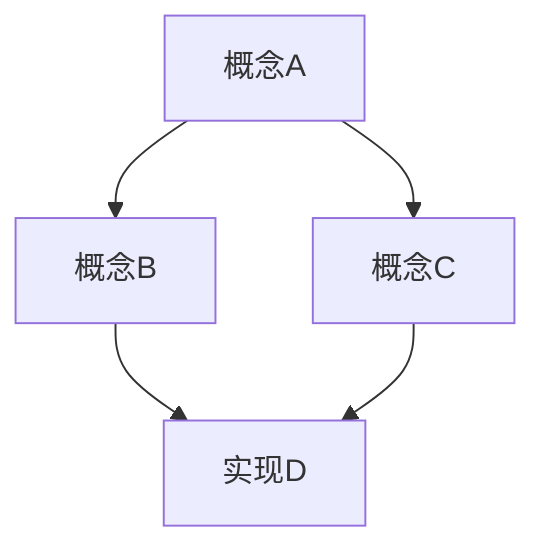

# 游戏引擎开发文档最佳实践与模板

## 一、文档结构模板

### 1.1 顶层架构

```
docs/
├── README.md                    # 文档入口与导航
├── getting-started/             # 入门指南
├── architecture/                # 架构概览
├── modules/                     # 模块设计文档
├── api-reference/              # API 参考文档
├── guides/                     # 开发者指南
├── tutorials/                  # 教程与示例
├── best-practices/            # 最佳实践
├── troubleshooting/           # 故障排除
├── glossary/                   # 术语表
└── changelog/                  # 文档更新日志
```

### 1.2 架构概览文档模板

**文件位置**: `architecture/README.md`

```markdown
# 引擎架构概览

## 简介
简要描述引擎的定位、目标和核心特性。

## 系统架构图
提供高层次架构图，展示：
- 核心子系统及其关系
- 数据流向
- 主要模块边界

## 核心子系统

### 渲染系统
- 职责描述
- 关键组件
- 与其他系统的交互

### 资源管理系统
- 职责描述
- 资源生命周期
- 异步加载机制

### ECS（实体-组件-系统）
- 架构设计理念
- 组件分类
- 系统执行顺序

### 脚本系统
- 支持的语言
- 绑定机制
- 生命周期钩子

### 物理系统
- 物理引擎集成
- 碰撞检测
- 物理模拟

### 音频系统
- 音频处理流程
- 3D 音频支持
- 音效管理

## 设计原则
列出引擎的核心设计原则，例如：
- 数据驱动设计
- 模块化与可扩展性
- 性能优先
- 跨平台支持

## 扩展阅读
- [模块设计文档](../modules/README.md)
- [API 参考文档](../api-reference/README.md)
```

### 1.3 模块设计文档模板

**文件位置**: `modules/[module-name]/README.md`

```markdown
# [模块名称] 模块设计

## 概述
模块的核心功能和职责。

## 模块架构图
展示模块内部结构、类关系和数据流。

## 核心类与接口

### [类名1]
**职责**: 简要描述

**关键方法**:
```cpp
// 方法签名与简要说明
void Initialize(const Config& config);
void Update(float deltaTime);
void Shutdown();
```

**使用示例**:
```cpp
// 代码示例
```

### [类名2]
...

## 数据结构

### [数据结构名]
描述数据结构的用途和字段。

## 配置与参数
列出模块可配置的参数及其默认值。

## 依赖关系
- 内部依赖：其他模块
- 外部依赖：第三方库

## 性能考虑
- 性能瓶颈分析
- 优化建议
- 内存使用注意事项

## 线程安全
说明模块的线程安全策略。

## 扩展性
如何扩展此模块的功能。

## 测试
- 单元测试覆盖范围
- 集成测试场景
- 性能测试基准

## 更新历史
记录重要的设计变更。
```

### 1.4 API 参考文档模板

**文件位置**: `api-reference/[namespace]/[class-name].md`

```markdown
# [类名]

**命名空间**: `[命名空间]`
**模块**: `[模块名]`
**继承**: `父类名` (如有)

## 描述
类的详细描述和用途。

## 头文件
```cpp
#include <engine/path/to/header.h>
```

## 构造函数

### [构造函数名]
```cpp
ClassName(参数列表);
```
**参数**:
- `param1`: 参数描述
- `param2`: 参数描述

**异常**: 可能抛出的异常

**示例**:
```cpp
auto obj = ClassName(arg1, arg2);
```

## 公共方法

### [方法名]
```cpp
返回类型 MethodName(参数列表);
```

**描述**: 方法的详细说明

**参数**:
- `param1`: (类型) 参数描述

**返回值**: 返回值说明

**异常**: 可能的异常

**注意**: 重要提示

**示例**:
```cpp
// 使用示例
```

**参见**: 相关方法或类

## 属性

### [属性名]
```cpp
Type GetPropertyName() const;
void SetPropertyName(Type value);
```

**描述**: 属性说明

## 静态方法

### [静态方法名]
...

## 枚举与常量

### enum [枚举名]
```cpp
enum class EnumName {
    Value1,  // 描述
    Value2,  // 描述
};
```

## 运算符重载

### operator [运算符]
...

## 友元类

## 版本历史
记录 API 的变更历史。

## 另见
相关类和文档链接。
```

### 1.5 开发者指南模板

**文件位置**: `guides/[topic]/README.md`

```markdown
# [主题] 开发指南

## 概述
本指南的目标和适用场景。

## 前置知识
阅读本指南前需要了解的内容。

## 快速开始

### 环境配置
步骤说明...

### Hello World
最简单的示例...

## 核心概念

### 概念1
详细解释...

### 概念2
详细解释...

## 详细步骤

### 步骤1: [标题]
详细说明...

#### 子步骤
...

### 步骤2: [标题]
...

## 最佳实践
- 最佳实践1
- 最佳实践2
- ...

## 常见陷阱
- 陷阱1: 描述和解决方案
- 陷阱2: 描述和解决方案

## 进阶主题

### [进阶主题1]
说明...

### [进阶主题2]
说明...

## 性能优化
性能相关的建议和技巧。

## 调试与故障排除
常见问题的解决方法。

## 完整示例
提供一个完整的示例项目链接。

## 参考资料
- 相关文档链接
- 外部资源

## 术语表
本指南涉及的专用术语。
```

## 二、关键概念文档化

### 2.1 核心概念文档模板

**文件位置**: `architecture/concepts/[concept-name].md`

```markdown
# [概念名称]

## 一句话定义
简洁的一句话定义。

## 详细解释
深入阐述概念的含义、背景和重要性。

### 为什么需要这个概念？
解释概念存在的必要性。

### 核心原理
讲解概念的底层原理。

## 概念关系图



## 相关概念

| 概念 | 关系 | 说明 |
|------|------|------|
| 概念A | 父概念 | ... |
| 概念B | 子概念 | ... |
| 概念C | 相关概念 | ... |

## 实现方式
概念在引擎中的具体实现。

### 实现示例
```cpp
// 代码示例
```

## 使用场景
列举具体的使用场景。

### 场景1: [标题]
描述场景和如何应用该概念。

### 场景2: [标题]
...

## 优缺点

### 优点
- 优点1
- 优点2

### 缺点
- 缺点1
- 缺点2

### 替代方案
介绍可能的替代方案及其对比。

## 性能影响
概念对性能的影响分析。

## 学习资源
- 相关教程链接
- 视频教程
- 示例项目

## 常见问题

### Q: 问题1？
A: 回答...

### Q: 问题2？
A: 回答...

## 历史演进
概念在引擎版本中的演变。
```

### 2.2 核心概念清单

#### 渲染相关
- **渲染管线 (Rendering Pipeline)**
  - 前向渲染 vs 延迟渲染
  - 渲染流程阶段
  - 着色器系统
  - 材质系统

- **光照系统**
  - 直接光照
  - 间接光照（全局光照）
  - 光照探针
  - 阴影技术

- **后处理**
  - 后处理栈
  - 特效类型
  - 性能优化

#### 资源管理
- **资产生命周期**
  - 导入 (Import)
  - 处理 (Process)
  - 加载 (Load)
  - 使用 (Use)
  - 卸载 (Unload)

- **异步加载**
  - 资源流式加载
  - 加载优先级
  - 内存管理

- **资源引用**
  - 强引用 vs 弱引用
  - 资源依赖追踪
  - 热重载

#### ECS 架构
- **实体 (Entity)**
  - 实体标识符
  - 实体生命周期

- **组件 (Component)**
  - 数据组件
  - 标签组件
  - 组件存储策略

- **系统 (System)**
  - 系统执行顺序
  - 系统依赖
  - 并行系统

#### 其他核心概念
- **场景管理**
  - 场景图结构
  - 空间划分
  - 视锥剔除

- **物理系统**
  - 碰撞检测
  - 物理模拟
  - 物理组件

- **脚本系统**
  - 脚本生命周期
  - 脚本绑定
  - 热重载

### 2.3 学习路径设计

**文件位置**: `getting-started/learning-paths.md`

```markdown
# 学习路径

根据您的背景选择合适的学习路径：

## 路径一：我是游戏开发新手

### 第一阶段：基础概念 (2-3周)
1. [引擎介绍](../architecture/README.md)
2. [安装与配置](./installation.md)
3. [编辑器基础](./editor-basics.md)
4. [创建第一个场景](./first-scene.md)

### 第二阶段：核心技能 (4-6周)
1. [脚本基础](../guides/scripting-basics.md)
2. [游戏对象与组件](../architecture/concepts/game-objects.md)
3. [资源管理](../architecture/concepts/asset-management.md)
4. [物理入门](../guides/physics-intro.md)

### 第三阶段：进阶主题 (持续)
1. [渲染系统](../architecture/concepts/rendering-pipeline.md)
2. [动画系统](../guides/animation.md)
3. [UI 系统](../guides/ui-system.md)

### 推荐项目
- 2D 平台游戏
- 简单的 3D 射击游戏

---

## 路径二：我有游戏开发经验，想学习本引擎

### 快速入门 (1周)
1. [引擎架构概览](../architecture/README.md)
2. [核心概念对比](./concept-mapping.md) - 与其他引擎的概念对照
3. [快速上手指南](./quick-start.md)

### 核心模块深入 (2-4周)
1. [渲染管线](../modules/rendering/README.md)
2. [ECS 系统](../architecture/concepts/ecs.md)
3. [资源管理](../modules/asset-management/README.md)

### 推荐项目
- 移植一个已有项目
- 开发一个技术演示

---

## 路径三：我想深入掌握引擎开发

### 引擎架构研究 (4-8周)
1. [架构设计文档](../architecture/README.md)
2. [模块设计文档](../modules/README.md)
3. [性能优化指南](../best-practices/performance.md)

### 贡献指南
1. [贡献流程](../contributing/README.md)
2. [编码规范](../contributing/coding-standards.md)
3. [提交 PR](../contributing/pull-requests.md)

### 推荐任务
- 修复 Bug
- 添加新特性
- 优化性能
```

## 三、文档维护策略

### 3.1 文档与代码同步

#### 策略一：文档即代码 (Docs as Code)

**原则**:
- 文档与代码在同一仓库管理
- 使用 Markdown 或 reStructuredText 格式
- 使用 Git 进行版本控制
- 文档变更与代码变更一起提交

**实践方法**:

```yaml
# .github/workflows/docs.yml
name: Documentation CI

on:
  pull_request:
    paths:
      - 'docs/**'
      - 'include/**'
  push:
    branches: [main]
    paths:
      - 'docs/**'

jobs:
  lint:
    runs-on: ubuntu-latest
    steps:
      - uses: actions/checkout@v3
      - name: Lint Markdown
        run: npm install -g markdownlint-cli && markdownlint docs/
      
      - name: Check links
        run: npm install -g markdown-link-check && find docs -name "*.md" -exec markdown-link-check {} \;
  
  build:
    runs-on: ubuntu-latest
    steps:
      - uses: actions/checkout@v3
      - name: Build docs
        run: |
          pip install sphinx sphinx-rtd-theme
          cd docs && make html
      
      - name: Deploy to GitHub Pages
        if: github.event_name == 'push'
        run: |
          # 部署脚本
```

#### 策略二：内联文档 + API 文档生成

**C++ 代码注释规范**:

```cpp
/**
 * @file Renderer.h
 * @brief 渲染器核心类
 * @author Your Name
 * @date 2024-01-15
 */

#pragma once

namespace Engine {
namespace Rendering {

/**
 * @class Renderer
 * @brief 主渲染器类，负责场景的渲染流程
 * 
 * Renderer 管理整个渲染管线，包括：
 * - 场景遍历与剔除
 * - 渲染命令生成
 * - GPU 资源管理
 * 
 * @code
 * // 使用示例
 * auto renderer = std::make_unique<Renderer>();
 * renderer->Initialize(config);
 * renderer->RenderScene(scene, camera);
 * @endcode
 * 
 * @see RenderPipeline
 * @see Camera
 */
class Renderer {
public:
    /**
     * @brief 初始化渲染器
     * 
     * @param config 渲染器配置参数
     * @return true 初始化成功
     * @return false 初始化失败
     * 
     * @throws std::runtime_error 当 GPU 不支持所需特性时
     * 
     * @note 必须在任何渲染操作前调用此方法
     * @warning 不支持在运行时重新初始化
     */
    bool Initialize(const RendererConfig& config);
    
    /**
     * @brief 渲染场景
     * 
     * @param scene 要渲染的场景
     * @param camera 渲染使用的相机
     * 
     * @par 性能考虑:
     * 此方法会在 GPU 上提交渲染命令，执行时间取决于场景复杂度。
     * 对于复杂场景，建议使用异步渲染模式。
     * 
     * @since version 1.0
     */
    void RenderScene(Scene* scene, Camera* camera);
    
    /**
     * @brief 获取当前帧的渲染统计信息
     * 
     * @return const RenderStats& 渲染统计信息引用
     * 
     * @see RenderStats
     */
    const RenderStats& GetStats() const { return m_stats; }

private:
    RenderStats m_stats;  ///< 渲染统计信息
};

} // namespace Rendering
} // namespace Engine
```

**使用 Doxygen 生成 API 文档**:

```bash
# Doxyfile 配置
PROJECT_NAME           = "Game Engine"
OUTPUT_DIRECTORY       = docs/api-reference
INPUT                  = include src
RECURSIVE              = YES
FILE_PATTERNS          = *.h *.cpp
EXTRACT_ALL            = YES
EXTRACT_PRIVATE        = NO
GENERATE_HTML          = YES
HAVE_DOT               = YES
UML_LOOK               = YES
CALL_GRAPH             = YES
CALLER_GRAPH           = YES
```

#### 策略三：自动化文档检查

```python
# scripts/check_docs.py
"""
检查文档与代码的同步性
"""

import os
import re
from pathlib import Path

def check_api_docs_sync():
    """
    检查所有公共 API 是否有对应的文档
    """
    # 查找所有头文件中的公共类和方法
    headers = Path('include').rglob('*.h')
    
    for header in headers:
        with open(header, 'r') as f:
            content = f.read()
            
        # 查找公共 API
        public_apis = re.findall(r'class\s+(\w+)', content)
        public_apis += re.findall(r'void\s+(\w+)\s*\(', content)
        
        # 检查是否有对应文档
        for api in public_apis:
            doc_file = Path(f'docs/api-reference/{api}.md')
            if not doc_file.exists():
                print(f"⚠️  缺少文档: {api} (from {header})")
                # 创建占位文档
                create_stub_doc(api, doc_file)

def check_code_examples():
    """
    验证文档中的代码示例是否可编译
    """
    import subprocess
    
    doc_files = Path('docs').rglob('*.md')
    
    for doc in doc_files:
        # 提取代码块
        with open(doc, 'r') as f:
            content = f.read()
        
        code_blocks = re.findall(r'```cpp\n(.*?)\n```', content, re.DOTALL)
        
        for i, code in enumerate(code_blocks):
            # 编译测试
            test_file = Path(f'/tmp/test_{doc.stem}_{i}.cpp')
            test_file.write_text(code)
            
            result = subprocess.run(
                ['g++', '-fsyntax-only', '-std=c++17', str(test_file)],
                capture_output=True
            )
            
            if result.returncode != 0:
                print(f"❌ 文档 {doc} 中的代码示例 #{i} 编译失败:")
                print(result.stderr.decode())

if __name__ == '__main__':
    check_api_docs_sync()
    check_code_examples()
```

### 3.2 文档版本管理

#### 多版本文档架构

```
docs/
├── versions/
│   ├── v1.0/
│   │   ├── index.html -> redirect to stable
│   │   └── ...
│   ├── v1.1/
│   ├── v1.2/ (stable)
│   └── latest/ (development)
├── index.html  # 重定向到 stable 版本
└── version.json
```

**版本切换器实现**:

```html
<!-- docs/_templates/version.html -->
<div class="version-switcher">
    <select id="version-select">
        <option value="stable">Stable (v1.2)</option>
        <option value="latest">Latest (dev)</option>
        <option value="v1.1">v1.1</option>
        <option value="v1.0">v1.0</option>
    </select>
</div>

<script>
document.getElementById('version-select').addEventListener('change', function() {
    const version = this.value;
    window.location.href = `/docs/versions/${version}/${window.location.pathname.split('/').pop()}`;
});
</script>
```

**Sphinx 多版本配置**:

```python
# docs/conf.py
import subprocess

# 获取当前版本
def get_version():
    try:
        return subprocess.check_output(['git', 'describe', '--tags']).decode().strip()
    except:
        return 'dev'

release = get_version()
version = '.'.join(release.split('.')[:2])

# 多版本构建
# sphinx-multiversion docs docs/_build/html
```

**ReadTheDocs 配置**:

```yaml
# .readthedocs.yaml
version: 2

build:
  os: ubuntu-22.04
  tools:
    python: "3.11"

sphinx:
  configuration: docs/conf.py

python:
  install:
    - requirements: docs/requirements.txt

# 多版本配置
versions:
  - stable
  - latest
  - v1.2
  - v1.1
```

#### API 变更追踪

**废弃 API 标记**:

```cpp
// 在代码中标记废弃 API
class [[deprecated("Use NewRenderer instead")]] OldRenderer {
    // ...
};

// 或使用宏
#define ENGINE_DEPRECATED(msg) [[deprecated(msg)]]

class ENGINE_DEPRECATED("Use NewClass instead") OldClass {
    ENGINE_DEPRECATED("Use NewMethod instead")
    void OldMethod();
};
```

**废弃 API 文档模板**:

```markdown
# OldClass

> ⚠️ **已废弃**
> 
> 此类已在版本 1.3 中废弃，将在版本 2.0 中移除。
> 
> **请使用**: [NewClass](./new-class.md)
> 
> **迁移指南**: [迁移到 NewClass](../guides/migration/new-class.md)

## 描述
[原有描述...]

## 迁移指南

### 从 OldClass 迁移到 NewClass

#### 旧代码
```cpp
OldClass obj;
obj.OldMethod();
```

#### 新代码
```cpp
NewClass obj;
obj.NewMethod();
```

#### 主要变更
1. 方法名变更: `OldMethod` -> `NewMethod`
2. 参数类型变更: `int` -> `size_t`
3. 返回值变更: `void` -> `Result`

## 版本历史
- **v1.0**: 引入
- **v1.3**: 废弃
- **v2.0**: 计划移除
```

### 3.3 文档自动化更新

#### CI/CD 集成

```yaml
# .github/workflows/docs-ci.yml
name: Documentation CI/CD

on:
  push:
    branches: [main, develop]
    paths:
      - 'docs/**'
      - 'include/**'
      - 'src/**'
  pull_request:
    branches: [main]
  release:
    types: [published]

jobs:
  build-and-deploy:
    runs-on: ubuntu-latest
    
    steps:
      - uses: actions/checkout@v3
        with:
          fetch-depth: 0  # 获取完整历史用于版本信息
      
      - name: Setup Python
        uses: actions/setup-python@v4
        with:
          python-version: '3.11'
      
      - name: Install dependencies
        run: |
          pip install -r docs/requirements.txt
          pip install sphinx-multiversion
      
      - name: Generate API docs
        run: |
          # 使用 Doxygen 生成 XML
          doxygen Doxyfile
          
          # 转换为 Sphinx 格式
          breathe-apidoc -o docs/api-reference doxyoutput/xml
      
      - name: Build documentation
        run: |
          cd docs
          # 多版本构建
          sphinx-multiversion . _build/html
          
          # 或单版本构建
          sphinx-build -b html . _build/html
      
      - name: Check broken links
        run: |
          cd docs
          sphinx-build -b linkcheck . _build/linkcheck
      
      - name: Deploy to GitHub Pages
        if: github.event_name == 'push' && github.ref == 'refs/heads/main'
        uses: peaceiris/actions-gh-pages@v3
        with:
          github_token: ${{ secrets.GITHUB_TOKEN }}
          publish_dir: ./docs/_build/html
      
      - name: Upload artifact
        uses: actions/upload-artifact@v3
        with:
          name: documentation
          path: docs/_build/html

  notify-doc-changes:
    runs-on: ubuntu-latest
    needs: build-and-deploy
    if: github.event_name == 'pull_request'
    
    steps:
      - uses: actions/checkout@v3
      
      - name: Check for doc changes
        id: changes
        run: |
          git diff --name-only origin/main... | grep -q "^docs/" && echo "::set-output name=has_changes::true" || echo "::set-output name=has_changes::false"
      
      - name: Comment on PR
        if: steps.changes.outputs.has_changes == 'true'
        uses: actions/github-script@v6
        with:
          script: |
            github.rest.issues.createComment({
              issue_number: context.issue.number,
              owner: context.repo.owner,
              repo: context.repo.repo,
              body: '📚 文档已更新，请预览: [Preview](https://your-docs-site.com/pr/${{ github.event.pull_request.number }})'
            })
```

#### 自动化文档更新脚本

```python
#!/usr/bin/env python3
"""
自动化文档更新工具
"""

import os
import json
import subprocess
from pathlib import Path
from datetime import datetime

class DocUpdater:
    def __init__(self, repo_path):
        self.repo_path = Path(repo_path)
        self.doc_path = self.repo_path / 'docs'
        
    def update_changelog(self):
        """
        自动更新文档变更日志
        """
        changelog_path = self.doc_path / 'changelog.md'
        
        # 获取最近的提交
        result = subprocess.run(
            ['git', 'log', '--oneline', '--since="1 week ago"', '--', 'docs/'],
            cwd=self.repo_path,
            capture_output=True,
            text=True
        )
        
        new_entries = []
        for line in result.stdout.strip().split('\n'):
            if line:
                commit_hash, message = line.split(' ', 1)
                new_entries.append({
                    'hash': commit_hash,
                    'message': message,
                    'date': datetime.now().strftime('%Y-%m-%d')
                })
        
        if new_entries:
            with open(changelog_path, 'a') as f:
                f.write(f"\n## {datetime.now().strftime('%Y-%m-%d')}\n\n")
                for entry in new_entries:
                    f.write(f"- {entry['message']} ({entry['hash']})\n")
    
    def update_api_coverage(self):
        """
        生成 API 文档覆盖率报告
        """
        # 查找所有公共 API
        headers = list(self.repo_path.rglob('*.h'))
        
        total_apis = 0
        documented_apis = 0
        
        for header in headers:
            with open(header, 'r') as f:
                content = f.read()
            
            # 查找类和方法
            classes = re.findall(r'class\s+\w+', content)
            methods = re.findall(r'\w+\s+\w+\s*\([^)]*\)\s*[;{]', content)
            
            total_apis += len(classes) + len(methods)
            
            # 检查是否有文档注释
            doc_comments = re.findall(r'/\*\*.*?\*/', content, re.DOTALL)
            documented_apis += len(doc_comments)
        
        coverage = (documented_apis / total_apis * 100) if total_apis > 0 else 0
        
        # 更新覆盖率报告
        report = {
            'date': datetime.now().isoformat(),
            'total_apis': total_apis,
            'documented_apis': documented_apis,
            'coverage_percent': round(coverage, 2)
        }
        
        with open(self.doc_path / 'api-coverage.json', 'w') as f:
            json.dump(report, f, indent=2)
        
        return coverage
    
    def generate_toc(self):
        """
        自动生成文档目录
        """
        toc = ["# 文档目录\n"]
        
        # 遍历文档目录
        for root, dirs, files in os.walk(self.doc_path):
            level = root.replace(str(self.doc_path), '').count(os.sep)
            indent = '  ' * level
            
            # 添加目录标题
            dir_name = os.path.basename(root)
            if dir_name and dir_name != 'docs':
                toc.append(f"{indent}- **{dir_name.title()}**\n")
            
            # 添加文件
            for file in sorted(files):
                if file.endswith('.md') and file != 'README.md':
                    file_path = os.path.join(root, file)
                    rel_path = os.path.relpath(file_path, self.doc_path)
                    
                    # 读取文件标题
                    with open(file_path, 'r') as f:
                        first_line = f.readline()
                        title = first_line.replace('#', '').strip()
                    
                    toc.append(f"{indent}  - [{title}]({rel_path})\n")
        
        # 写入目录文件
        with open(self.doc_path / 'toc.md', 'w') as f:
            f.writelines(toc)

if __name__ == '__main__':
    updater = DocUpdater('/path/to/engine/repo')
    updater.update_changelog()
    coverage = updater.update_api_coverage()
    updater.generate_toc()
    print(f"API 文档覆盖率: {coverage}%")
```

#### 文档质量检查工具

```python
#!/usr/bin/env python3
"""
文档质量检查工具
"""

import re
from pathlib import Path
from collections import defaultdict

class DocQualityChecker:
    def __init__(self, doc_path):
        self.doc_path = Path(doc_path)
        self.issues = defaultdict(list)
    
    def check_all(self):
        """
        执行所有检查
        """
        self.check_spelling()
        self.check_links()
        self.check_formatting()
        self.check_examples()
        self.report()
    
    def check_spelling(self):
        """
        检查拼写错误
        """
        # 常见技术词汇白名单
        whitelist = {'GameEngine', 'GameObject', 'Update', 'Initialize', 'Shader'}
        
        # 使用 spellchecker 或自定义词典
        for md_file in self.doc_path.rglob('*.md'):
            with open(md_file, 'r') as f:
                for line_num, line in enumerate(f, 1):
                    # 简单的拼写检查逻辑
                    words = re.findall(r'\b[a-zA-Z]+\b', line)
                    # ... 检查逻辑
                    pass
    
    def check_links(self):
        """
        检查链接有效性
        """
        for md_file in self.doc_path.rglob('*.md'):
            with open(md_file, 'r') as f:
                content = f.read()
            
            # 查找所有链接
            links = re.findall(r'\[.*?\]\((.*?)\)', content)
            
            for link in links:
                if link.startswith('http'):
                    # 检查外部链接
                    # 使用 requests 检查
                    pass
                else:
                    # 检查内部链接
                    target = (md_file.parent / link).resolve()
                    if not target.exists():
                        self.issues[md_file].append(
                            f"Broken link: {link}"
                        )
    
    def check_formatting(self):
        """
        检查格式一致性
        """
        for md_file in self.doc_path.rglob('*.md'):
            with open(md_file, 'r') as f:
                lines = f.readlines()
            
            # 检查标题层级
            prev_level = 0
            for line_num, line in enumerate(lines, 1):
                if line.startswith('#'):
                    level = line.count('#')
                    if level > prev_level + 1:
                        self.issues[md_file].append(
                            f"Line {line_num}: Heading level skipped (from {prev_level} to {level})"
                        )
                    prev_level = level
            
            # 检查代码块闭合
            code_blocks = re.findall(r'```', ''.join(lines))
            if len(code_blocks) % 2 != 0:
                self.issues[md_file].append(
                    "Unclosed code block"
                )
    
    def check_examples(self):
        """
        检查代码示例
        """
        for md_file in self.doc_path.rglob('*.md'):
            with open(md_file, 'r') as f:
                content = f.read()
            
            # 提取代码块
            code_blocks = re.findall(r'```(\w+)\n(.*?)\n```', content, re.DOTALL)
            
            for lang, code in code_blocks:
                if lang in ['cpp', 'c++', 'c']:
                    self._check_cpp_code(md_file, code)
    
    def _check_cpp_code(self, file_path, code):
        """
        检查 C++ 代码示例
        """
        # 检查基本的语法问题
        open_braces = code.count('{')
        close_braces = code.count('}')
        
        if open_braces != close_braces:
            self.issues[file_path].append(
                f"Mismatched braces in C++ code example"
            )
    
    def report(self):
        """
        生成检查报告
        """
        print("\n=== 文档质量检查报告 ===\n")
        
        if not self.issues:
            print("✅ 所有检查通过！")
            return
        
        for file, issues in self.issues.items():
            print(f"\n📄 {file.relative_to(self.doc_path)}")
            for issue in issues:
                print(f"  ⚠️  {issue}")
        
        print(f"\n总计: {sum(len(i) for i in self.issues.values())} 个问题")

if __name__ == '__main__':
    checker = DocQualityChecker('/path/to/docs')
    checker.check_all()
```

## 四、现有方案参考分析

### 4.1 Unity 文档特点

**优点**:
1. **清晰的双层结构**: Manual (用户手册) + Scripting API (API 参考)
2. **版本隔离**: 明确的版本标识，支持多版本切换
3. **模块化组织**: 按功能模块组织文档（渲染、物理、UI 等）
4. **最佳实践**: 专门的 Best Practice Guides 章节
5. **故障排除**: 独立的 Troubleshooting 章节
6. **术语表**: 统一的术语定义
7. **搜索集成**: 强大的搜索功能
8. **交互式示例**: 可运行的代码示例

**可借鉴点**:
- 版本管理策略
- 文档分类方法
- 术语表设计
- 最佳实践章节

### 4.2 Godot 文档特点

**优点**:
1. **学习路径导向**: 根据用户背景提供不同入口
2. **多语言标签页**: 支持不同编程语言的代码示例
3. **开源协作**: GitHub 编辑集成，社区贡献友好
4. **离线支持**: 提供离线文档下载
5. **翻译系统**: 多语言支持，翻译进度可视化
6. **文档更新日志**: Documentation Changelog 追踪变更

**可借鉴点**:
- 学习路径设计
- 多语言代码示例
- 开源协作流程
- 离线文档方案

### 4.3 Unreal Engine 文档特点

**优点**:
1. **深度教程**: 详细的步骤式教程
2. **蓝图集成**: 可视化编程与代码混合文档
3. **API 与指南整合**: API 文档与使用指南紧密结合
4. **平台专项**: 针对不同平台的专项文档
5. **性能指南**: 详细的性能优化文档

**可借鉴点**:
- 深度教程设计
- 性能文档组织
- 平台差异化文档

## 五、推荐工具栈

### 5.1 文档生成工具

| 工具 | 用途 | 优势 |
|------|------|------|
| **Sphinx** | 文档站点生成 | 强大、灵活、多格式输出 |
| **Doxygen** | API 文档生成 | C++ 原生支持、自动解析 |
| **MkDocs** | 静态文档站点 | 简单易用、Material 主题美观 |
| **Docusaurus** | 文档站点 | React 生态、功能丰富 |

### 5.2 文档质量工具

| 工具 | 用途 |
|------|------|
| **markdownlint** | Markdown 格式检查 |
| **linkchecker** | 链接有效性检查 |
| **vale** | 语法和风格检查 |
| **codespell** | 拼写检查 |

### 5.3 部署平台

| 平台 | 特点 |
|------|------|
| **ReadTheDocs** | 免费、多版本支持、搜索集成 |
| **GitHub Pages** | 免费、Git 集成、自定义域名 |
| **Vercel** | 自动部署、预览环境、CDN |
| **Netlify** | 自动部署、表单处理、CDN |

## 六、实施建议

### 6.1 分阶段实施

**第一阶段：基础建设 (1-2月)**
- 搭建文档框架
- 编写核心概念文档
- 配置 API 文档生成
- 建立基本 CI/CD

**第二阶段：内容完善 (2-4月)**
- 完善模块文档
- 编写开发者指南
- 添加最佳实践
- 建立术语表

**第三阶段：自动化与维护 (持续)**
- 完善自动化检查
- 建立文档审查流程
- 收集用户反馈
- 持续优化更新

### 6.2 团队协作建议

1. **文档责任制度**
   - 每个模块指定文档负责人
   - 代码变更必须同步更新文档
   - 定期文档审查会议

2. **贡献指南**
   - 明确文档贡献流程
   - 提供文档模板
   - 建立文档风格指南

3. **质量把控**
   - PR 模板包含文档检查项
   - 自动化检查集成到 CI
   - 定期文档质量审计

---

## 附录：文档模板快速参考

### A. 模块文档清单

```
modules/[module-name]/
├── README.md              # 模块概览
├── architecture.md        # 架构设计
├── api-guide.md          # API 使用指南
├── integration.md        # 集成指南
├── performance.md        # 性能指南
├── troubleshooting.md    # 故障排除
└── examples/
    ├── basic.md          # 基础示例
    └── advanced.md       # 高级示例
```

### B. 文档审查清单

- [ ] 标题清晰，层级合理
- [ ] 代码示例可运行
- [ ] 链接有效
- [ ] 格式一致
- [ ] 无拼写错误
- [ ] 包含使用场景
- [ ] 性能注意事项
- [ ] 版本兼容性说明
- [ ] 相关文档链接

### C. 常用 Markdown 扩展语法

```markdown
<!-- 警告框 -->
> ⚠️ **警告**: 重要提示

> 💡 **提示**: 有用信息

> 🔧 **技术细节**: 实现细节

<!-- 代码块带文件名 -->
```cpp title="example.cpp"
int main() {
    return 0;
}
```

<!-- 标签页 -->
=== "C++"
    ```cpp
    // C++ code
    ```

=== "Lua"
    ```lua
    -- Lua code
    ```

<!-- 数学公式 -->
$$
E = mc^2
$$

<!-- Mermaid 图表 -->

```

---

**文档版本**: v1.0
**最后更新**: 2024-01-15
**维护者**: 文档团队
